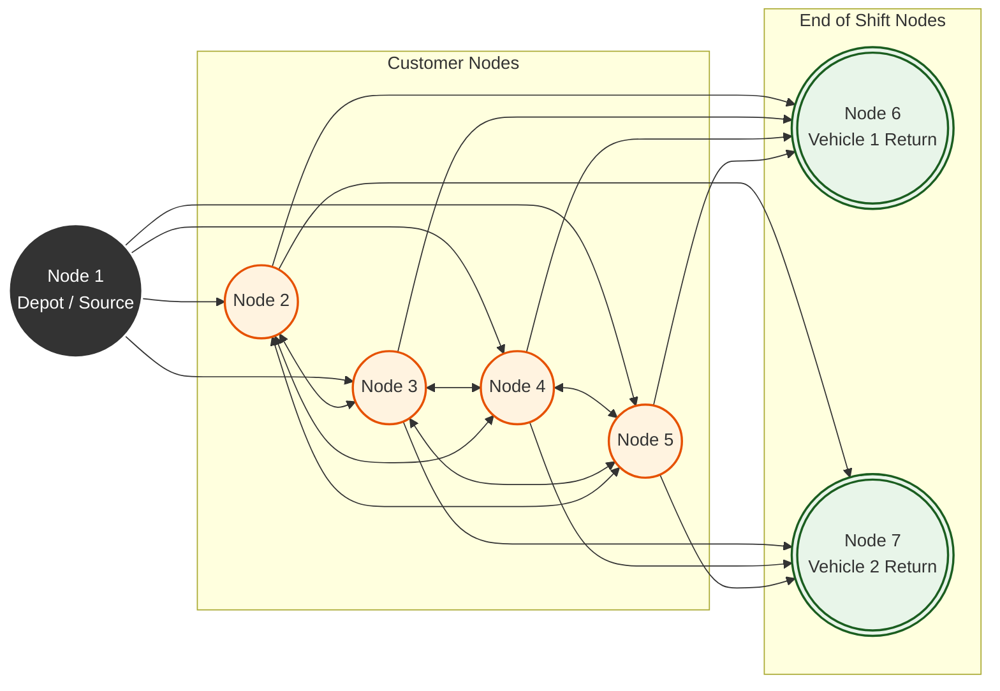

# Time-Dependent Vehicle Routing Problem (TDVRP)

---

## Problem Formulation

The network is modeled as a complete directed graph `G(V, E)` consisting of `v` nodes (the physical customer locations plus the depot) and `e` links. In this model, the travel time between two points is not static; it depends on both the physical distance and the specific time of day the travel occurs.

### The Time-Dependent Step Function
The network utilizes an `N x N` time-dependent matrix `C(t) = [cij(t)]`. The travel time on link `(i, j)` is calculated as a step function of the departure time `t` at the origin node `i`. 

The operational day is divided into distinct time intervals (`M`). Once the departure time falls into a specific interval, the transit time for that link becomes a known constant. To represent this mathematically, the problem uses an expanded network where each physical link `(i, j)` is replaced by `M` parallel links, representing the varying traffic speeds across the day.

### Graph Transformation (The Sink Nodes)
To formulate this as a Mixed Integer Linear Programming (MILP) problem and completely eliminate mathematical routing loops, the depot architecture is modified into a one-way flow system:

* **The Source (Node 1):** The central depot is treated strictly as a "Start Only" point. All inbound links to this node are removed.
* **The Sinks (Nodes N+1 to N+K):** We introduce `K` virtual nodes to represent the "End of the Shift" for each of the `K` vehicles. 
* **One-Way Flow:** All vehicles start at Node 1 and must terminate at one of the unique return nodes. The calculated travel time to any sink node is exactly equal to the travel time to the original physical depot.

In this formulation, every node `i` has exactly one continuous variable `ti` representing the exact time the vehicle arrives at that node. 

### Core Assumptions
1. **Vehicle Independence:** The travel time across any interval `M` is independent of the vehicle type (a standard baseline for urban environments).
2. **Service Independence:** The collection or delivery time depends entirely on the customer, not the vehicle type.

### Visualizing the Graph Transformation (K=2 Vehicles)
To eliminate mathematical routing loops, the depot architecture is modified into a one-way flow system. The original depot becomes a "Start Only" node, and we generate virtual "End of Shift" sink nodes for every vehicle in the fleet.

---

## Mixed Integer Linear Programming (MILP) Model

The TDVRP is formulated as a Mixed Integer problem because it must simultaneously track discrete routing decisions (integer variables) and exact arrival schedules (continuous variables). 

By expanding the depot into `K` sinks, the objective function naturally minimizes the total route time across all vehicles:

The complete formulation enforces strict constraints for node visitation, capacity limits, flow conservation, and the time-dependent link traversal:

