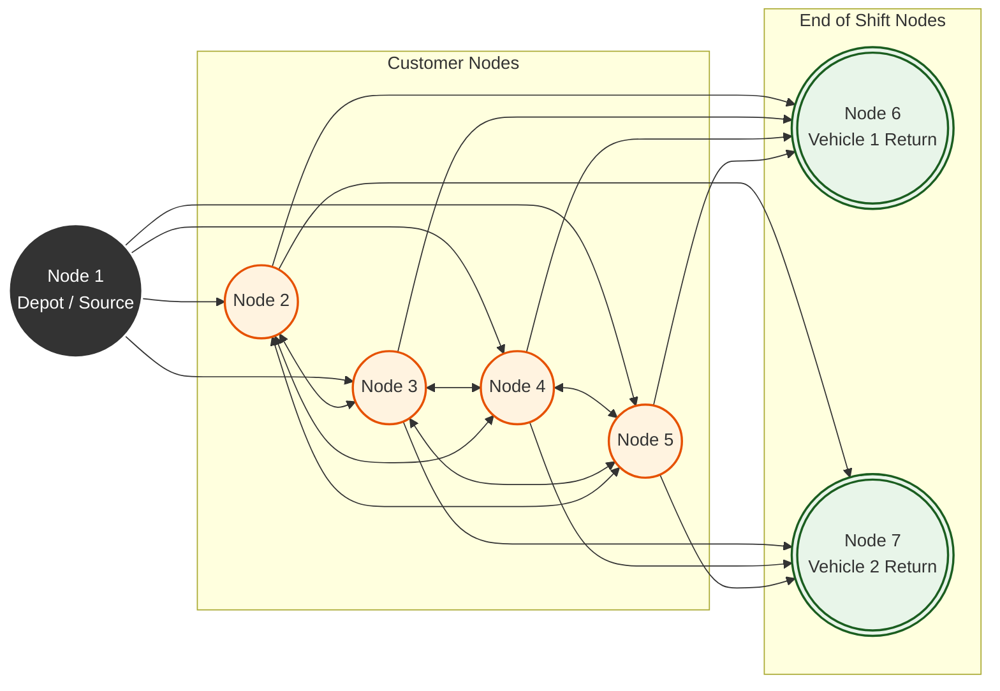

# Time-Dependent Vehicle Routing Problem (TDVRP)

---

## Problem Formulation

The network is modeled as a complete directed graph `G(V, E)` consisting of `v` nodes (the physical customer locations plus the depot) and `e` links. In this model, the travel time between two points is not static; it depends on both the physical distance and the specific time of day the travel occurs.

### The Time-Dependent Step Function
The network utilizes an `N x N` time-dependent matrix `C(t) = [cij(t)]`. The travel time on link `(i, j)` is calculated as a step function of the departure time `t` at the origin node `i`. 

The operational day is divided into distinct time intervals (`M`). Once the departure time falls into a specific interval, the transit time for that link becomes a known constant. To represent this mathematically, the problem uses an expanded network where each physical link `(i, j)` is replaced by `M` parallel links, representing the varying traffic speeds across the day.

### Graph Transformation (The Sink Nodes)
To formulate this as a Mixed Integer Linear Programming (MILP) problem and completely eliminate mathematical routing loops, the depot architecture is modified into a one-way flow system:

* **The Source (Node 1):** The central depot is treated strictly as a "Start Only" point. All inbound links to this node are removed.
* **The Sinks (Nodes N+1 to N+K):** We introduce `K` virtual nodes to represent the "End of the Shift" for each of the `K` vehicles. 
* **One-Way Flow:** All vehicles start at Node 1 and must terminate at one of the unique return nodes. The calculated travel time to any sink node is exactly equal to the travel time to the original physical depot.

In this formulation, every node `i` has exactly one continuous variable `ti` representing the exact time the vehicle arrives at that node. 

### Core Assumptions
1. **Vehicle Independence:** The travel time across any interval `M` is independent of the vehicle type (a standard baseline for urban environments).
2. **Service Independence:** The collection or delivery time depends entirely on the customer, not the vehicle type.

### Visualizing the Graph Transformation (K=2 Vehicles)
To eliminate mathematical routing loops, the depot architecture is modified into a one-way flow system. The original depot becomes a "Start Only" node, and we generate virtual "End of Shift" sink nodes for every vehicle in the fleet.

---

## Mixed Integer Linear Programming (MILP) Model

The TDVRP is formulated as a Mixed Integer problem because it must simultaneously track discrete routing decisions (integer variables) and exact arrival schedules (continuous variables). 

By expanding the depot into `K` sinks, the objective function naturally minimizes the total route time across all vehicles:

The complete formulation enforces strict constraints for node visitation, capacity limits, flow conservation, and the time-dependent link traversal:

---

## Heuristic Methodologies

Because exact mathematical proofs fail on realistically sized networks, the engine implements two algorithmic architectures to construct feasible routes efficiently.

### Route Construction Architectures
* **Sequential Dispatch (SEQ):** A local greedy approach. It deploys a single vehicle, assigning it customers until it hits a capacity or time limit, and only then wakes a new truck from the depot.
* **Simultaneous Dispatch (SIM):** A global greedy approach. At every step, it evaluates all unvisited customers against *all* currently active trucks plus available garage trucks, prioritizing system-wide speed over fleet minimization.

### Different Heuristics (The 4 Variants)
To determine the "best" move during construction, four distinct evaluation logics were implemented. Variant 1 acts as the academic baseline, while Variants 2, 3, and 4 represent novel extensions developed for this project.

1. **V1: Shortest Travel Time (Baseline):** A pure greedy approach optimizing only for driving duration. Often fails because trucks rush to closed time windows and are forced to sit idle.
2. **V2: Earliest Start Time (Novel):** Shifts optimization to arrival time. Reduces gate idling but ignores service duration, frequently trapping trucks in peak traffic upon departure.
3. **V3: Earliest Finish Time (Novel):** Optimizes for absolute completion (Travel + Wait + Service). Naturally prioritizes nearby customers who are ready for immediate processing.
4. **V4: Probabilistic Selection (Novel):** Looks at the top 5 options of the Earliest Finish Time and randomly chooses one. It repeats this process over 20 iterations and picks the highest-performing outcome to escape local optima.

---

### 1) Base Fleets

We implemented all four heuristics on a total of 500 instances across three map structures (Clustered, Random, and Mixed) to simulate diverse urban and suburban environments. To strictly test the time-dependency, travel velocities were subjected to 4 distinct time intervals across the operational day.

**i) Base Homogeneous Fleets :**
The initial benchmarking phase assumed a depot of identically sized vehicles. We applied the 4 heuristics and evaluated the success percentage of finding a valid solution across all three mapped methodologies. This isolated the time-dependent routing logic to prove it could navigate traffic constraints before introducing capacity variance.

**ii) Base Heterogeneous Fleets :**
The fleet constraint was then upgraded to include vehicles of varying capacities. We applied all 4 heuristics using the following dispatch strategies:

* **SEQ-LS (Sequential Large-to-Small):** This strategy uses the highest capacity vehicles first to clear dense, high-demand clusters before the traffic trap hits.
* **SEQ-SL (Sequential Small-to-Large):** This efficiency strategy saves larger demand for the end of the day, using small trucks for morning deliveries to minimize wasted capacity.
* **SIM (Simultaneous Best-Fit):** A hybrid of bin-packing and time-greedy logic. We looked at all vehicles and all customers simultaneously. For each customer, the algorithm finds the smallest garage truck that fits their demand (Best-Fit). Those Best-Fit options are put into a global pool with all other active trucks. The entire pool is then sorted by Earliest Finish Time (V3).

---

### 2) Benchmark with MILP Implementation

To rigorously evaluate the heuristics against exact mathematical proofs, a set of challenging benchmark instances was generated. The parameters closely mirror the methodology established in the foundational **Malandraki & Daskin (1992)** paper, but with extremely tight capacity constraints to stress-test the algorithms.

**Benchmark Generation Parameters:**
* **Network Size ($n$):** Small-scale networks consisting of 10, 15, 20, and 25 customers.
* **Time Intervals ($m$):** 2 or 3 distinct traffic periods per operational day.
* **Travel & Service Times:** Base travel times randomized [20, 80] and mapped to a $100 \times 100$ coordinate grid; service (unloading) durations randomized between [10, 20] minutes.
* **Strict Capacity Constraints:** Fleet size restricted to between $n/6$ and $n/2$. Capacities were tightly calibrated so that the total fleet capacity exceeded total network demand by **exactly 10%**, forcing the algorithms to perform highly efficient bin-packing to survive.

#### The 10-Minute Timeout & The `< 1.00` Ratio
These generated instances were fed into an exact SCIP MILP solver. Because the TDVRP is NP-Hard, the exact solver was capped at a **10-minute (600s) time limit** per instance. For nearly all networks where $n \ge 15$, the solver failed to find the optimal proof within the limit, returning only a "feasible at best" solution.

We evaluated the algorithms using a `Heuristic Time / MILP Best Time` ratio. Theoretically, an optimal ratio should always be $\ge 1.00$. However, our results frequently yielded outputs of **`< 1.00`**. 

This anomaly occurred because the custom C++ heuristics successfully discovered a *faster, more efficient route in mere seconds* than the exact mathematical solver could find in 10 full minutes of computation. Most notably, the novel heuristics developed for this project (**V2, V3, and V4**) consistently and significantly outperformed the baseline **V1 (Travel Time)** heuristic provided in the original 1992 paper.
<table>
  <tr>
    <td align="center">
      
    </td>
    <td align="center">
      
    </td>
  </tr>
</table>

